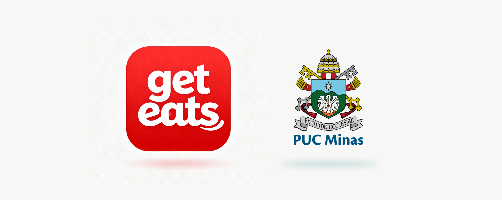

# Get Eats

`CURSO: Sistemas de Informação`

`DISCIPLINA: - Aplicações Web`

`SEMESTRE: 1º`

O projeto "Get Eats" é uma aplicação web desenvolvida no contexto da disciplina "Projeto - Aplicações Web" do curso de Sistemas de Informação, com o objetivo de criar um sistema completo de pedidos online para restaurantes como a "Burguer House". Ele aborda o crescente mercado de delivery de alimentos no Brasil, oferecendo uma solução tecnológica acessível para estabelecimentos de pequeno e médio porte, permitindo o gerenciamento de cardápios, processamento de pedidos, autenticação de usuários e acompanhamento em tempo real, visando modernizar processos operacionais e melhorar a experiência do cliente.

A aplicação integra funcionalidades administrativas para proprietários, como painel de controle de produtos e estatísticas, e interfaces responsivas para clientes, incluindo navegação por categorias, carrinho de compras e histórico de pedidos. Desenvolvido em etapas progressivas, desde documentação e especificação até implementação em HTML, CSS e JavaScript, o projeto justifica-se pela demanda do setor de food service, que movimenta bilhões de reais anualmente, e busca reduzir custos operacionais enquanto atende às necessidades de conveniência dos consumidores urbanos.

## Integrantes

* Ana Luiza da Silva Borges
* Célio Pedro Sá Almeida 
* Enzo Monteiro Martuscelli 
* Miguel José de Castro Garcia

## Orientador

* Alisson Rabelo Arantes 

# Planejamento

| Etapa         | Atividades |
|  :----:   | ----------- |
| ETAPA 1         |[Documentação de Contexto](docs/context-geteats.md)   [Especificação do Projeto](docs/especification-geteats.md) |
| ETAPA 2         |[Projeto de Interface](docs/interface-geteats.md)   [Template Padrão](docs/template-geteats.md) |
| ETAPA 3         |[Programação de Funcionalidades - HTML e CSS](docs/development-geteats.md) |
| ETAPA 4        |[Programação de Funcionalidades - Javascript](docs/development.md)   [Testes de Software ](docs/tests-geteats.md) |
| ETAPA 5         | [Apresentação](presentation/README.md) |

# Código

<li><a href="src/README.md"> Código Fonte</a></li>

# Apresentação

<li><a href="presentation/README.md"> Apresentação da solução</a></li>
