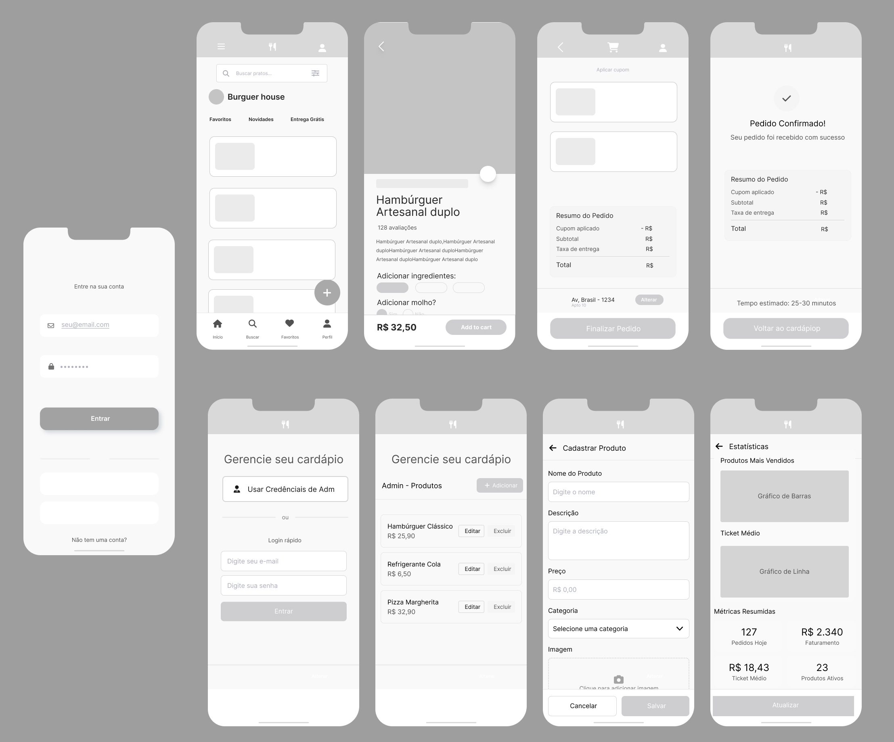

# Projeto de Interface

O Projeto de Interface da solução GetEats apresenta a visão geral da experiência do usuário na plataforma, descrevendo as telas principais e o fluxo de interação necessário para a realização de pedidos online. O objetivo é representar de forma clara como o sistema organiza e exibe informações, possibilitando que usuários finais naveguem no cardápio, personalizem seus pedidos e finalizem compras de maneira simples e intuitiva.

Além disso, o projeto contempla a perspectiva administrativa, oferecendo telas voltadas à gestão do cardápio, cadastro de produtos e acompanhamento de métricas de desempenho. Dessa forma, a solução GetEats não apenas atende aos requisitos funcionais e não funcionais levantados, mas também oferece suporte à operação dos estabelecimentos parceiros, garantindo eficiência e praticidade no atendimento digital.

# Ambientes de Desenvolvimento e Implantação

## 1. Ambiente de Desenvolvimento
- **Objetivo:** Onde a equipe vai programar e testar o código.  
- **Ferramentas/Tecnologias:**  
  - **VS Code:** editor de código, onde vamos escrever e rodar os testes da aplicação.  
  - **Linguagens:** HTML, CSS e JavaScript.  
  - **Controle de versão:** GitHub para salvar e organizar o código.  
- **Uso no processo:** Cada integrante baixa o projeto do GitHub, cria uma parte do sistema no seu computador, testa no navegador e depois envia as alterações para o repositório.  

---

## 2. Ambiente de Teste / Homologação
- **Objetivo:** Local usado para testar o sistema antes de colocar no ar.  
- **Ferramentas/Tecnologias:**  
  - **GitHub (versão de teste):** para simular como o sistema ficará publicado.  
  - **VS Code**  
- **Uso no processo:** Depois que uma parte é criada, a equipe publica em uma versão de teste. Assim, é possível verificar se o sistema funciona bem em diferentes celulares e computadores.  

---

## 3. Ambiente de Produção
- **Objetivo:** Onde o sistema final ficará disponível para os usuários.  
- **Ferramentas/Tecnologias:**  
  - **GitHub Pages:** usado para hospedar a versão final.  
  - **QR Code:** para que os clientes acessem o cardápio pelo celular.  
- **Uso no processo:** Quando o sistema estiver pronto e aprovado nos testes, ele será publicado na versão final e acessado pelos clientes via QR Code.  

---

# Organização do Código
- O código será salvo no GitHub, que guarda o histórico e permite que todos trabalhem juntos.  
- Alterações serão feitas em cópias separadas e depois juntadas ao projeto principal.  

---

# Gestão do Projeto
- A equipe vai usar ferramentas digitais para organizar as tarefas.  
- As etapas serão divididas em:  
  - **A Fazer →** tarefas que ainda não começaram.  
  - **Em Andamento →** o que está sendo desenvolvido.  
  - **Em Teste →** o que está sendo verificado.  
  - **Concluído →** tarefas prontas.  
- O grupo terá encontros rápidos semanais para alinhar o que já foi feito e o que falta.  

---

## User Flow
 
> O User Flow mapeia todo o fluxo de telas do sistema e as possíveis ações que o usuário pode realizar. Ele mostra de forma clara como o usuário navega entre telas e como cada etapa atende a um requisito funcional.

**Fluxos mapeados:**

1. **Onboarding do Cliente Corporativo**  
   - O estabelecimento (ex.: Burguer House) contrata o serviço, configura identidade e personaliza atendimento direcionando à plataforma geteats.

2. **Acesso de Usuários**  
   - *Usuários fidelizados*: login com e-mail e senha → acesso ao cardápio personalizado.  
   - *Novos usuários*: opção “Não tenho uma conta” para navegar e experimentar antes de criar conta.

3. **Navegação no Cardápio**  
   - Exibição de categorias e cards de produto; busca e filtros; promoções em destaque.  
   - Ações por item: adicionar direto ao carrinho ou abrir detalhes (descrição, ingredientes, tamanhos, adicionais).

4. **Gestão do Carrinho**  
   - Visualização dos itens, alteração de quantidade, remoção, aplicação de cupom, alteração de endereço de entrega.  
   - Apresentação de subtotal, taxa de entrega e total; botão **Finalizar Pedido**.

5. **Escolha da Forma de Pagamento**  
   - Opções: Cartão (crédito/débito), PIX, Pagamento na entrega.  
   - Interface adaptativa conforme opção (ex.: formulário de cartão vs instruções PIX).

6. **Confirmação de Pagamento**  
   - Validação dos dados, confirmação e feedback visual (spinner, mensagens de erro/sucesso).

7. **Pedido Aprovado / Rastreamento**  
   - Exibição do número do pedido, status (Preparando → A caminho → Entregue), tempo estimado de entrega e botão para acompanhar pedido.

---

## Wireframes – Descrição das Telas

### Tela de Login (Frame 01)  
- **Função:** Permitir que o usuário acesse sua conta para visualizar o cardápio personalizado e gerenciar pedidos.  
- **Elementos principais:**  
  - Campos de e-mail e senha.  
  - Botão de “Entrar”.  
  - Link para criação de nova conta.  
- **Requisitos atendidos:** autenticação de usuário e controle de acesso.

---

### Tela Inicial / Home (Frame 02)  
- **Função:** Apresentar os principais produtos e categorias do estabelecimento.  
- **Elementos principais:**  
  - Barra de busca no topo.  
  - Logo e nome do estabelecimento (“Burguer House”).  
  - Navegação inferior com ícones (Início, Buscar, Favoritos, Perfil, Carrinho).  
  - Cards de produtos e promoções em destaque.  
- **Requisitos atendidos:** exibição de produtos, categorização e navegação intuitiva.

---

### Tela de Detalhe do Produto (Frame 03)  
- **Função:** Exibir informações completas sobre o item selecionado.  
- **Elementos principais:**  
  - Nome do produto, avaliações e descrição.  
  - Opções de customização (ex.: adicionais, tamanho, molho).  
  - Preço destacado.  
  - Botão **Adicionar ao Carrinho**.  
- **Requisitos atendidos:** detalhamento de produto e personalização do pedido.

---

### Tela de Carrinho / Checkout (Frame 04)  
- **Função:** Permitir que o usuário revise os itens selecionados e avance para o pagamento.  
- **Elementos principais:**  
  - Listagem de produtos adicionados.  
  - Campo para aplicar cupom de desconto.  
  - Resumo de valores (subtotal, entrega, total).  
  - Opção para alterar endereço de entrega.  
  - Botão **Finalizar Pedido**.  
- **Requisitos atendidos:** gerenciamento do carrinho, aplicação de descontos e cálculo automático do pedido.

---

### Tela de Confirmação de Pedido (Frame 05)  
- **Função:** Informar ao usuário que o pedido foi concluído com sucesso.  
- **Elementos principais:**  
  - Mensagem de confirmação.  
  - Resumo do pedido (itens, cupom aplicado, subtotal, total).  
  - Estimativa de tempo de entrega.  
  - Botão para retornar ao cardápio.  
- **Requisitos atendidos:** feedback visual ao usuário e rastreabilidade do pedido.

---

### Tela de Login do Administrador (conjunto adm 01)  
- **Função:** Permitir acesso de administradores ao painel de gestão do cardápio.  
- **Elementos principais:**  
  - Campos de login (e-mail e senha).  
  - Botão “Usar Credenciais de Adm”.  
- **Requisitos atendidos:** autenticação administrativa.

---

### Tela de Gerenciamento de Produtos (Frame adm 02)  
- **Função:** Listar produtos cadastrados para edição ou exclusão.  
- **Elementos principais:**  
  - Lista de produtos com nome e preço.  
  - Botões **Editar** e **Excluir**.  
  - Botão **Adicionar Produto**.  
- **Requisitos atendidos:** manutenção de catálogo de produtos.

---

### Tela de Cadastro de Produto (Frame adm 03)  
- **Função:** Adicionar novos produtos ao cardápio.  
- **Elementos principais:**  
  - Campos de nome, descrição, preço, categoria e upload de imagem.  
  - Botão **Salvar**.  
- **Requisitos atendidos:** inserção de novos itens no sistema de forma estruturada.

---

### Tela de Estatísticas / Relatórios (Frame adm 04)  
- **Função:** Exibir dados de desempenho para o administrador.  
- **Elementos principais:**  
  - Gráficos (barras, linha) com informações de vendas.  
  - Métricas resumidas (pedidos feitos, faturamento, ticket médio, produtos ativos).  
  - Botão **Atualizar**.  
- **Requisitos atendidos:** monitoramento de indicadores e apoio à tomada de decisão.

---
